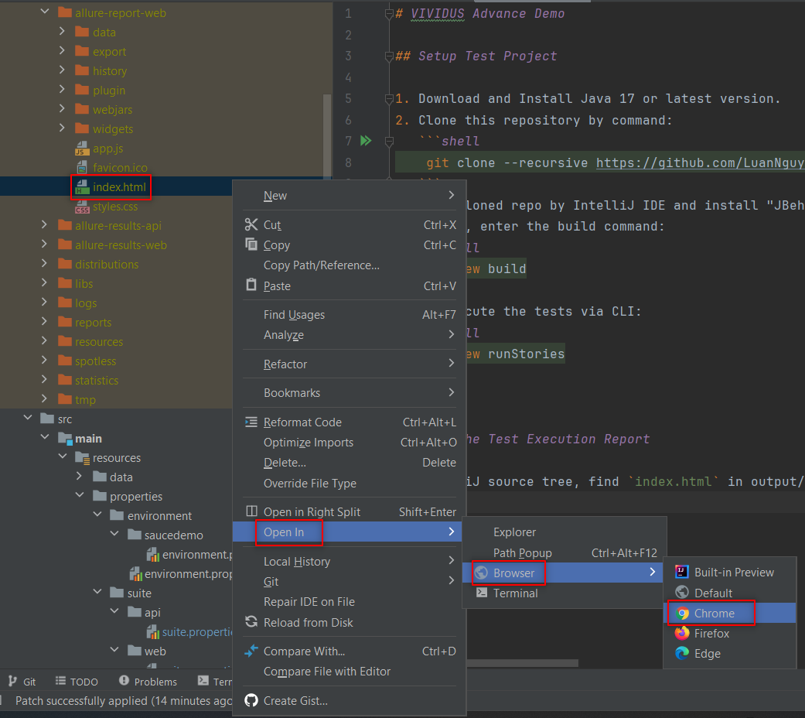

# VIVIDUS Advance Demo

## Setup Test Project

1. Download and Install Java 17 or latest version.
2. Clone this repository by command:
   ```shell
    git clone --recursive https://github.com/LuanNguyenBao/vividus-advance-demo.git
   ```
3. Open cloned repo by IntelliJ IDE and install "JBehave" addon.
4. In CLI, enter the build command:
   ```shell
    gradlew build
   ```
5. To execute the tests via CLI:
   ```shell
    gradlew runStories
   ```


## View The Test Execution Report

On IntelliJ source tree, find `index.html` in output/reports/allure folder > Right click and select Open In > Select which browser that you want to run

